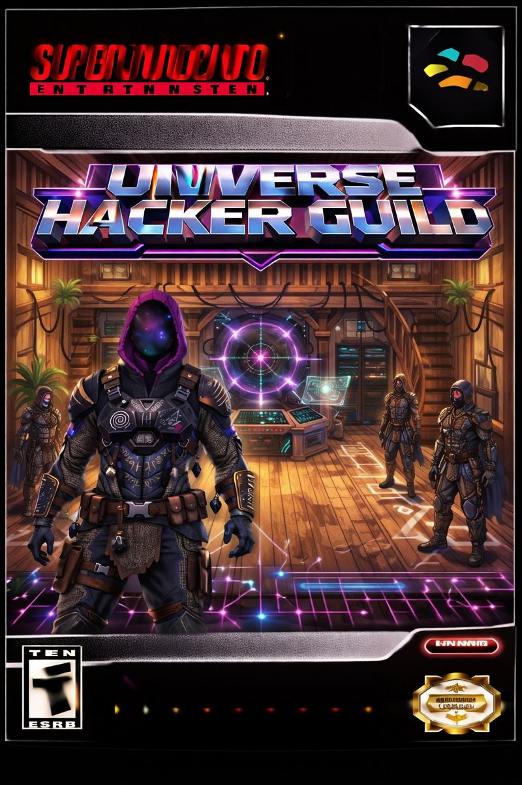
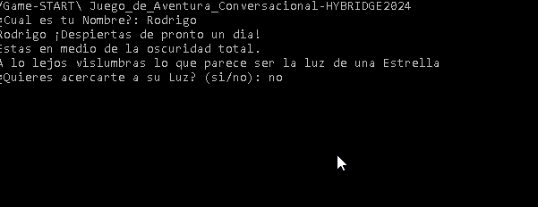
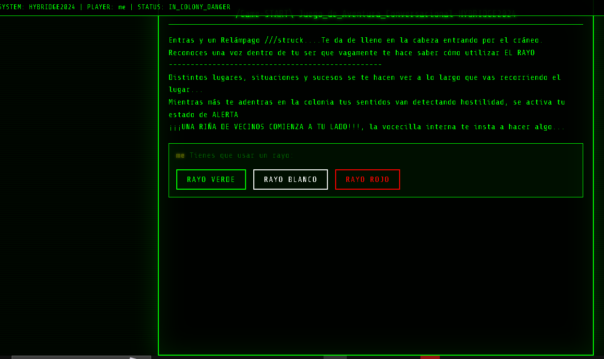
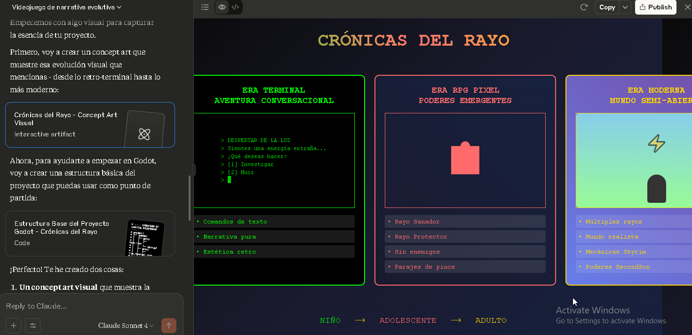
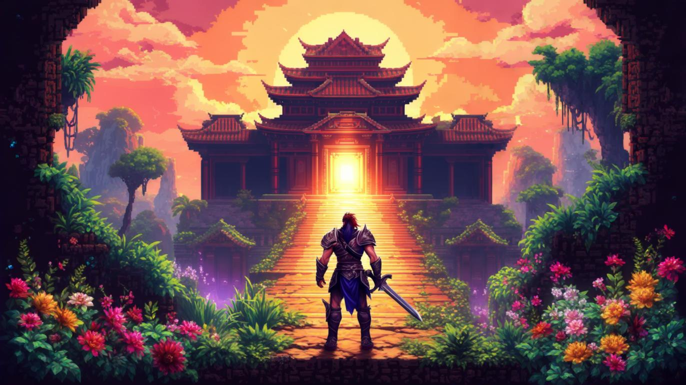

```text
██╗  ██╗██╗   ██╗██████╗ ██████╗ ██████╗  ██████╗  ██████╗ ███████╗
█ Crónicas del Rayo

           ══════════════════════════════════════
            Capítulo 1: El Despertar de la Luz
           ═════════════════════════════════════
```


# Legacy





# 🎮 Estructura Básica de la Lógica detras del Juego==Run.Main_Story

   ```
🌟 Árbol de Decisiones
Inicio
¿Quieres acercarte a la Luz? (si / no)
   🔹 Si eliges si
      Eres transportado a la entrada de una colonia desértica.
      ¿Deseas entrar a la colonia? (si / no)
         🏚️ Si eliges si
            Entras y recibes un rayo en la cabeza.
            Debes usar un rayo: verde, blanco, rojo
               Verde: es de sanación, pero no resuelve la situación → mueres
               Blanco: armoniza el conflicto → misión verdadera comienza
               Rojo: intensifica el caos → mueres
         🧙‍♂️ Si eliges no
            Un Maestro te guía y te explica los rayos.
            Luego ocurre el mismo conflicto vecinal.
              Debes usar un rayo: verde, blanco, rojo
                Verde: es de sanación, pero no resuelve la situación → mueres
                Blanco: armoniza el conflicto → misión verdadera comienza
                Rojo: intensifica el caos → mueres
    🔹 Si eliges no
Flotas en la oscuridad. Una voz te ofrece iniciar tu propósito.
  ¿Te gustaría inicializar el Propósito? (si / no)
     ✨ Si eliges si
        Se repite el mismo camino que si hubieras dicho sí a la Luz (Ir hasta arriba).
      🚫 Si eliges no
  Fin del juego.

   ```


----------------------------------------------------------------------------------

----------------------------------------------------------------------------------


# Stage 2 - La evolucion de la Arquitectura del Juego de acuerdo con la historia 





# Arquitectura del Juego en Godot
```
# ===== ESTRUCTURA DE CARPETAS RECOMENDADA =====
# project/
# ├── scenes/
# │   ├── main/
# │   │   ├── Main.tscn
# │   │   └── Main.gd
# │   ├── eras/
# │   │   ├── Era1_Terminal.tscn
# │   │   ├── Era2_RPG.tscn
# │   │   └── Era3_Modern.tscn
# │   ├── ui/
# │   │   ├── TerminalUI.tscn
# │   │   └── RPGMenu.tscn
# │   └── characters/
# │       └── Player.tscn
# ├── scripts/
# │   ├── managers/
# │   │   ├── GameManager.gd
# │   │   └── EraManager.gd
# │   └── systems/
# │       ├── DialogueSystem.gd
# │       └── PowerSystem.gd
# ├── assets/
# │   ├── fonts/
# │   ├── audio/
# │   └── textures/
# └── data/
#     ├── dialogues/
#     └── powers/

```


# ===== MAIN.GD - Controlador Principal =====


   ```
aventura-del-rayo/
├── index.html          # Entry point (start screen)
├── approach.html       # Approach screen
├── colony_entry.html   # Colony entry screen
├── darkness.html       # Darkness screen
├── purpose_yes.html    # Purpose accepted screen
├── purpose_no.html     # Purpose rejected screen
├── colony.html         # Colony screen
├── master.html         # Master screen
├── outcomes/           # Folder for outcome screens
│   ├── green_outcome_purpose.html
│   ├── white_outcome_purpose.html
│   ├── red_outcome_purpose.html
│   ├── green_outcome_no_purpose.html
│   ├── white_outcome_no_purpose.html
│   ├── red_outcome_no_purpose.html
│   ├── green_outcome_colony.html
│   ├── white_outcome_colony.html
│   ├── red_outcome_colony.html
│   ├── green_outcome_master.html
│   ├── white_outcome_master.html
│   ├── red_outcome_master.html
├── css/
│   ├── styles.css      # Shared CSS
├── js/
│   ├── game.js         # Game logic and states
│   ├── utils.js        # Utility functions

   ```
# Un pixel art 

